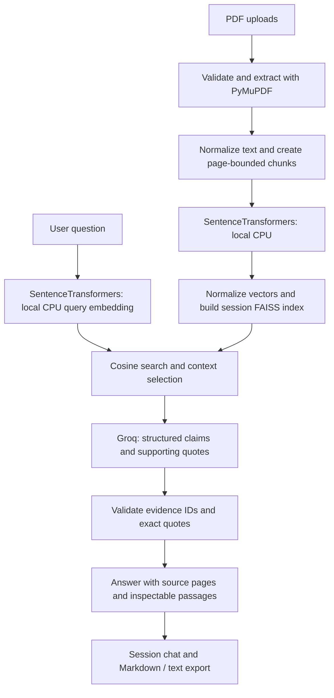

# Folio

**A focused workspace for asking questions of your PDFs—and checking the evidence.**

Folio is a Python RAG application built with Streamlit. Upload text-based PDFs, index
them with SentenceTransformers on the server's CPU, and ask questions answered by Groq using
retrieved passages. Every accepted claim includes a reference to a real source page.
Open the evidence to read the supporting excerpt and its full retrieved passage.

No accounts, database, GPU, embedding API key, or permanent chat history.
Groq is the only external AI API; local embeddings have no API quota.

**Screenshots:** [empty workspace](assets/empty-workspace.png) ·
[conversation and evidence](assets/conversation.png). Captured from the actual UI;
the conversation screenshot uses a generated sample PDF and mocked AI services.


## What it does

- Validates multiple PDFs independently; one bad file does not discard good documents.
- Preserves document identity, filename, page number, and chunk ID throughout retrieval.
- Uses page-bounded chunks with sentence/paragraph boundaries and overlapping context.
- Batches local CPU embeddings and reuses document vectors for the active session.
- Searches a local FAISS CPU index with cosine similarity and repeated-context filtering.
- Validates evidence IDs and supporting quotes before displaying generated claims.
- Separates citations actually used by the answer from all retrieved context.
- Supports concise, detailed, and simple explanations; the grounding rules stay the same.
- Exports questions, answers, and citations as Markdown or plain text.
- Warns about session loss, confirms chat-clearing actions, and registers a browser exit guard.
- Provides an original dark document workspace with responsive layouts and visible keyboard focus.

## Run locally

Install [uv](https://docs.astral.sh/uv/getting-started/installation/) and Python 3.11–3.13,
then from the cloned repository:

```bash
uv sync
cp .env.example .env
# Edit .env with your server-side GROQ_API_KEY.
uv run streamlit run app.py
```

Open the local URL printed by Streamlit. Add one or more PDFs, select **Index
documents**, wait for **Ready**, then ask a question. Only the application operator
needs a Groq API key; visitors never enter an email address or sign up.
Indexing itself needs no API key. Local installation is optional when deploying:
the hosting platform can run `uv sync --locked` during its build using the committed
`pyproject.toml` and `uv.lock`. No manual PyTorch installation is required.

### Environment variables

| Variable | Purpose / default |
| --- | --- |
| `GROQ_API_KEY` | Required server key for generation |
| `GROQ_MODEL` | `openai/gpt-oss-20b` (must support JSON object mode) |
| `EMBEDDING_MODEL` | `sentence-transformers/all-MiniLM-L6-v2` |
| `EMBEDDING_DEVICE` | `cpu`; this deployment uses CPU explicitly |
| `MIN_SIMILARITY` | `0.25`; cosine threshold, **not** a calibrated confidence probability |

Model variables use the defaults shown above. SentenceTransformers encodes chunks
and questions locally without manual prefixes. Documents are encoded in batches of
32 and their vectors are cached for the current session; each new question is
encoded once. The model is loaded lazily and cached as a process-wide Streamlit
resource, so reruns and new sessions reuse it. Uploaded text and vectors are never
stored in that shared resource. Restart the app and begin a new session after
changing the embedding model; never mix vectors from different models.

## Architecture

PDF → PyMuPDF → Chunks → SentenceTransformers (local CPU) → FAISS → Retriever
→ Groq → Answer + Sources



The `Pipeline` object in `st.session_state` owns documents, vectors, index, text-vector
cache, and conversation. Only the embedding model is shared across sessions.
Streamlit reruns render this state without extracting or embedding documents again. An uploaded document
is committed only after all its embeddings and the replacement index are ready.
Successful embedding batches can be reused after a later batch fails.

### Extraction and retrieval

PyMuPDF reads each page separately using sorted text extraction. Blank pages retain
their original numbering but contribute no chunks. Text normalization joins line
wraps and preserves detected paragraph breaks. Default chunks are about 1,100
characters with a 200-character overlap; sentence and paragraph endings are
preferred, and tiny tails are merged. Chunks never cross page boundaries.

Vectors are checked for shape, finite values, and nonzero magnitude, then normalized
to unit length. FAISS `IndexFlatIP` provides exact cosine search. Index position `i`
maps to `chunks[i]`. Retrieval oversamples candidates, applies a configurable
similarity threshold, suppresses substantial repeated 5-word sequences, and selects
up to Top-K passages (default 5), within 7,200 characters. It does not guarantee
representation from every uploaded document.

For a referential follow-up such as “explain that,” the prior question can be added
to the retrieval query. At most two previous questions are supplied to Groq for
reference resolution. Previous answers are never supplied as factual evidence.
Disable this behavior in **Answer preferences** for an independent question.

### Grounding and citations

Groq receives the question, style, optional previous questions, and selected passage
text with request-local IDs (`E1`, `E2`, …). It never receives entire PDFs, vectors,
API keys, or unrelated session data in the prompt. Documents and questions are
explicitly treated as untrusted content, not instructions.

The model must return structured claims, each with evidence IDs and exact excerpts.
Python verifies that every ID was supplied and every supporting excerpt occurs in
the corresponding passage (whitespace normalized). Missing/unknown references,
fabricated quotes, malformed JSON, or incomplete generation invalidate the whole
answer. References are numbered and deduplicated by document identity and page;
filenames and page numbers come exclusively from extraction metadata.

If no context survives retrieval, Groq is not called. If the model finds insufficient
support or its response fails validation, the answer is:

> I couldn't find that information in the provided documents.

**These checks prove citation provenance and quote existence, not semantic
entailment.** A model can still misinterpret a valid quote, miss relevant context,
or follow a malicious passage despite instructions. Read the evidence before
relying on an answer. There is no calibrated confidence score or claim of perfect
grounding. The retrieval inspector deliberately shows unused context separately
from supporting citations.

## Session and privacy behavior

- Uploads are handled in memory. Folio does not write PDFs, indexes, or conversations
  to a database or permanent application storage.
- Extracted text and questions are embedded locally on the deployment server.
  Retrieved passages and questions are sent to Groq, which has its own retention and data policies.
  This is not an entirely local or offline tool.
- Removing a document rebuilds the index from retained vectors without re-embedding.
  Its historical answers and evidence remain in chat and are marked as removed.
- **Clear all documents** preserves chat; **New session** clears both, with a
  confirmation and export controls when chat exists.
- **Export Chat** downloads Markdown or plain text containing the export timestamp,
  document names, questions, answers, and source/page references. No internal IDs,
  vectors, provider configuration, or API keys are serialized.
- A small isolated [Streamlit v2 component](https://docs.streamlit.io/develop/api-reference/custom-components/st.components.v2.component)
  registers `beforeunload` while there are unexported turns. Clicking a download
  marks the current turns exported; a new answer reactivates the guard. The app
  cannot confirm that the browser actually saved the downloaded file.
- Browsers control the generic confirmation dialog; custom text is not used.
  User interaction is required, and mobile termination, crashes, disconnections,
  and server restarts can bypass it. The visible session notice remains essential.
- State lives for the Streamlit session's lifetime. Reloading can start a new
  session. Disconnected sessions may remain in memory until the server releases
  them; instant memory erasure is not guaranteed.

### Limits and cost controls

Defaults: 20 MB per PDF, 50 MB per session, 8 documents, 500 pages per PDF,
3,000 chunks per session, 40 questions, and 1,500 characters per question.
Tune server-side limits in `src/config.py`; the HTTP upload limit is also configured
in `.streamlit/config.toml`. File extensions, PDF headers, readability, passwords,
size, and extractable text are checked. Duplicate bytes do not trigger embeddings;
different PDFs with the same sanitized filename require renaming.

Embedding calls use batches of 32 on CPU. Only the query is freshly embedded for each
question. There are no automatic LLM summaries, LLM-powered decorations, or
automatic Groq retries. Timeouts and rate-limit errors preserve existing session
data and allow explicit retries. Provider error bodies and secrets are not printed
in the interface or logs.

## Tests and verification

```bash
uv run --no-sync --offline python -m unittest discover -s tests -v
```

The suite uses real generated PDFs and real FAISS, with a stub SentenceTransformer
and mock Groq client. It covers extraction (including blank/encrypted/broken files), chunk boundaries and
provenance, vector mappings, normalization, repetition filtering, session cache
reuse, failed-batch retries, transactional indexing, citation deduplication,
fabricated evidence rejection, insufficient context, exports, and Streamlit UI
session controls, cached model loading, CPU selection, and float32 vectors.
The standard suite needs no network, GPU, model download, or live Hugging Face access.

This uses the existing environment and does not install SentenceTransformers or
PyTorch. The other application dependencies must be available; production
dependencies remain declared for the deployment build. The optional real-model
test is skipped by default. To opt in on a machine that already has the embedding
stack and model cached, use `RUN_REAL_MODEL_TEST=1` with the same command. It uses
`local_files_only=True` and offline mode; missing dependencies or model files skip
only that integration test.

For browser-only QA with deterministic providers:

```bash
uv run --no-sync --offline streamlit run tests/browser_fixture.py --server.port 8502
```

This is explicitly a **test entry point**, not a deployment or product demo mode.
Use it to upload a small PDF, ask a question, expand citations, export, reload to
check the browser guard, and test clearing the session. Do not deploy it.

Before presenting a deployment, run a live acceptance check with your Groq key:

1. Index two real text PDFs; check source page counts and a known passage.
2. Ask a question with a known answer and inspect the citation and supporting text.
3. Ask a question absent from the documents; check the fallback.
4. Ask a follow-up and verify it stays supported by the documents.
5. Download the chat; compare its references against the UI.
6. Add another turn, reload, and confirm the browser offers its generic warning.
7. Remove a document and check that future answers no longer retrieve it.

Real-model download and embedding quality, Groq grounding quality, and Groq quotas
are not established by mocked tests. The browser fixture also uses a stub embedding
model, so it can check UI behavior without downloading model files.

## Deploy on a CPU host

Use a host with Python 3.11–3.13, a long-running Streamlit process, WebSocket support,
and writable storage for the model cache. Allow outbound HTTPS to the package
indexes during build, Hugging Face for the initial model download, and Groq for
generation. For example, configure a Render web service or equivalent Python host
with these build and start commands from the repository root:

```bash
uv sync --locked --no-dev
uv run --no-sync streamlit run app.py --server.address 0.0.0.0 --server.port "${PORT:-8501}" --server.headless true
```

`uv sync` also works on a fresh machine; `--locked` additionally checks that the
build uses the committed resolution. SentenceTransformers requires PyTorch
transitively; it is also declared directly so `uv` applies the CPU source to it.
The project follows [uv's CPU PyTorch index configuration](https://docs.astral.sh/uv/guides/integration/pytorch/):
Linux and Windows use the explicit CPU wheel index; macOS uses its PyPI wheels.
CUDA packages and a GPU are not required. Keep `EMBEDDING_DEVICE=cpu`.

Deployment is heavier than an API-only embedding setup because PyTorch and the
model files need disk and RAM. `uv sync` installs the libraries; the first indexing
operation downloads and loads `sentence-transformers/all-MiniLM-L6-v2` through
SentenceTransformers. First startup/use can therefore take longer. Subsequent
Streamlit reruns reuse the loaded model; subsequent processes reuse downloaded
files if the library's cache survives. Set `HF_HOME` to a writable persistent
directory if your host provides one. Without persistent storage, a fresh deployment
or instance may download the model again. The model cache contains pretrained
model files, not uploaded PDFs, document vectors, or chat history.

Configure `GROQ_API_KEY` as a server environment secret, not a frontend setting or
committed file. No embedding API key is needed. Put HTTPS in front of the app and
allow its WebSocket connection. Measure RAM, disk, cold-start time, and indexing
latency with representative PDFs before choosing an instance size. Multiple
instances require sticky sessions and still lose session state on restart.
No Docker, Node.js, GPU, or database is required.

For Streamlit Community Cloud, select `app.py` and Python 3.11 and provide the
environment variables as root-level TOML secrets in the dashboard. Streamlit makes
root-level secrets available as environment variables. Verify that the platform
uses the checked-in `uv.lock`; use the explicit commands above on other hosts.

An anonymous public deployment shares the operator's API budget. The limits here
are per session, not a global abuse-control system. Configure provider spending
caps and any host-level traffic controls appropriate to your deployment.

## Project map

```text
app.py                      Streamlit layout and session actions
.streamlit/config.toml      Theme, upload limit, telemetry setting
src/
  config.py                 Environment settings and resource limits
  models.py                 Document, chunk, hit, answer, citation, turn
  errors.py                 Safe provider failure messages
  ingestion/                PDF extraction and page-bounded chunking
  retrieval/                Local SentenceTransformers, FAISS, context selection
  generation/               Groq prompt and evidence validation
  rag/pipeline.py           Session orchestration
  export/chat_export.py     Markdown and plain-text export
  ui/                       Styling, evidence components, browser guard
tests/                      Unit, integration, AppTest, browser fixture
```

## Known limitations

No OCR, table reconstruction, layout-aware figures, cross-page chunks, reranker,
multi-hop planner, or exhaustive multi-document comparison. PDF extraction order
can be imperfect for columns, formulas, and tables. Long sentences may be split;
the embedding model can truncate inputs at its token limit. Retrieval thresholds are
model dependent, so some relevant passages may be excluded. Similarity filtering
can suppress repeated wording from separate documents. This is a small,
inspectable portfolio project, not a guarantee of exhaustive or error-free research.
