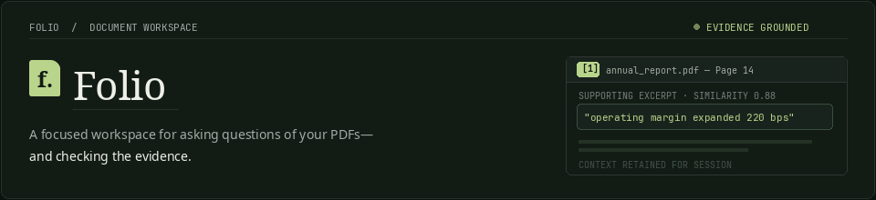
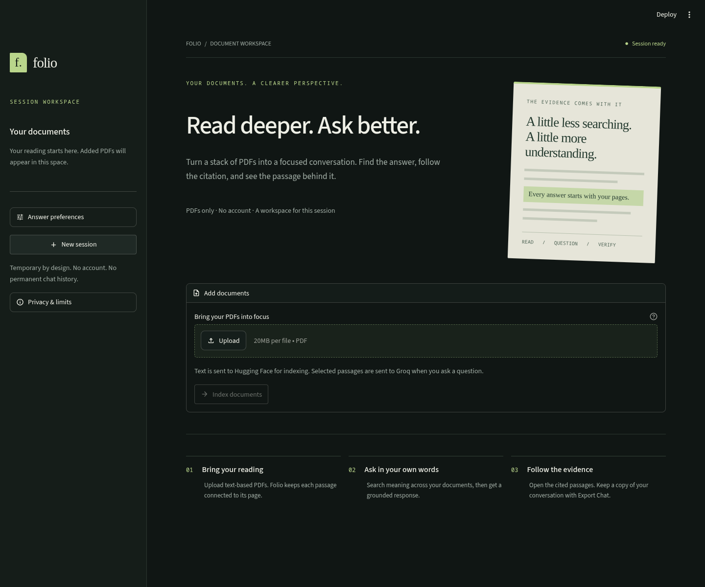
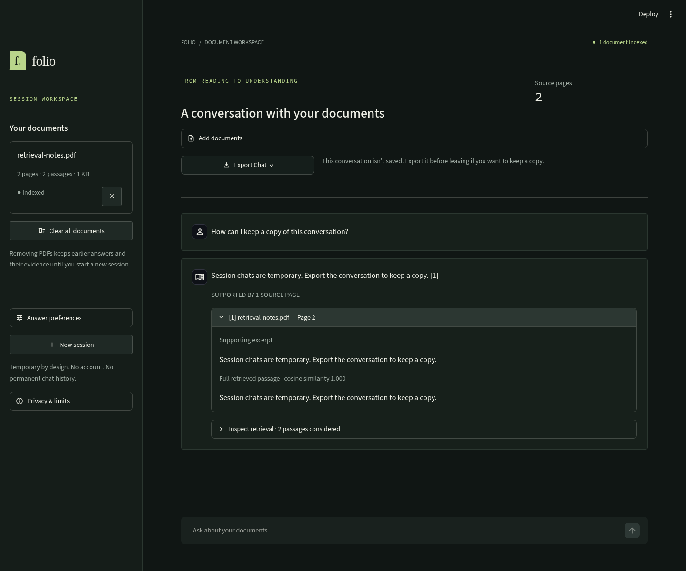

<p align="center">
  
</p>

<p align="center">
  <strong>A focused workspace for asking questions of your PDFs—and checking the evidence.</strong>
</p>

Folio is an in-memory, session-based Retrieval-Augmented Generation (RAG) application built with Python and Streamlit. It allows users to upload text-based PDFs, indexes them locally on the server's CPU with SentenceTransformers and FAISS, and answers questions through Groq using retrieved passages. Every answer is grounded in exact quotes verified in Python, pairing each claim with verifiable, page-level citations and inspectable source passages. Designed with privacy in mind, Folio runs with zero database dependencies, no user accounts, and no persistent document storage.

---

## Screenshots

| Empty Workspace | Active Conversation & Evidence Inspector |
| :---: | :---: |
|  |  |

*Screenshots captured directly from the running Streamlit UI.*

---

## Key Features

- **Strict Evidence Grounding**: Validates evidence IDs and verifies that supporting quotes exist verbatim in retrieved passages before displaying claims.
- **Page-Level Citations**: Deduplicates citations by document and physical page number; click any citation to view the supporting quote and full context.
- **Local CPU Embeddings**: Generates 384-dimensional embeddings on CPU via `all-MiniLM-L6-v2`; no external embedding API key or quota needed.
- **Exact Cosine Vector Search**: Fast inner-product similarity search over unit-normalized vectors using FAISS (`IndexFlatIP`).
- **Heuristic Near-Duplicate Filtering**: Excludes redundant passages using 5-word shingle overlap and enforces similarity thresholds.
- **Referential Follow-Ups**: Detects pronouns ("explain that", "elaborate") and enriches queries using previous questions.
- **Session Privacy & Ephemeral State**: PDFs and vectors exist only in server memory for the active session; no database storage or tracking.
- **Export Transcripts**: One-click download of questions, answers, and numbered page citations as clean Markdown or plain text.
- **Browser Exit Protection**: Built-in `beforeunload` guard warns users before accidental tab closure when unsaved turns exist.

---

## Tech Stack

| Layer | Technology |
| --- | --- |
| **Frontend & UI** | [Streamlit](https://streamlit.io/) (custom dark workspace theme, responsive components) |
| **PDF Extraction** | [PyMuPDF](https://pymupdf.readthedocs.io/) (sorted in-memory text extraction, NFKC normalization) |
| **Text Chunking** | Custom page-bounded chunker (sentence/paragraph preference, zero cross-page leakage) |
| **Embeddings** | [SentenceTransformers](https://www.sbert.net/) (`all-MiniLM-L6-v2`, local CPU execution) |
| **Vector Store** | [FAISS CPU](https://github.com/facebookresearch/faiss) (`IndexFlatIP`, exact cosine similarity) |
| **Generation** | [Groq](https://groq.com/) (`openai/gpt-oss-20b`, zero temperature, JSON object mode) |
| **Package Management** | [uv](https://docs.astral.sh/uv/) (deterministic CPU PyTorch resolution via `uv.lock`) |

---

## Architecture Summary

```
PDF Uploads (in-memory)
       │
       ▼
PyMuPDF Extraction & Page-Bounded Chunking
       │
       ▼
Local CPU Embeddings (SentenceTransformers) ──► FAISS Vector Store
                                                      │
User Question ──► Embedding ──► Cosine Retrieval ◄────┘
                                      │
                                      ▼
Groq LLM Generation (Structured Claims + Quoted Evidence)
                                      │
                                      ▼
Python Verification (Quote containment & Evidence ID validation)
                                      │
                                      ▼
Verified Answer + Page Citations + Inspectable Passages
```

For the complete module breakdown and architectural diagrams, see the [Architecture Guide](docs/architecture.md).

---

## Quick Local Setup

### Prerequisites

- Python 3.11–3.13
- [uv](https://docs.astral.sh/uv/getting-started/installation/)
- A free [Groq API Key](https://console.groq.com/)

### 1. Install Dependencies

```bash
uv sync
```

*Note: `uv sync` automatically installs lightweight CPU-only PyTorch wheels configured in `pyproject.toml`.*

### 2. Configure Environment

Copy the example `.env` file and add your Groq API key:

```bash
cp .env.example .env
```

```ini
GROQ_API_KEY=gsk_your_groq_api_key_here
```

### 3. Run the App

```bash
uv run streamlit run app.py
```

Open `http://localhost:8501`, upload one or more text PDFs, click **Index documents**, and start asking questions!

---

## Environment Variables

| Variable | Required | Default | Purpose |
| --- | --- | --- | --- |
| `GROQ_API_KEY` | **Yes** | `""` | Server-side key for Groq LLM inference. |
| `GROQ_MODEL` | No | `openai/gpt-oss-20b` | Groq chat model with JSON object mode support. |
| `EMBEDDING_MODEL` | No | `sentence-transformers/all-MiniLM-L6-v2` | Hugging Face model ID for local embeddings. |
| `EMBEDDING_DEVICE` | No | `cpu` | Execution device; must remain `cpu`. |
| `MIN_SIMILARITY` | No | `0.25` | Cosine similarity cutoff for retrieved passages. |

---

## Detailed Documentation

Comprehensive technical documentation is organized in the [`docs/`](docs/) directory:

- 📐 [**Architecture Guide**](docs/architecture.md): System components, data structures, and Streamlit session lifecycle.
- 🔄 [**RAG Pipeline Deep Dive**](docs/rag-pipeline.md): Step-by-step extraction, chunking, retrieval filtering, grounding, and fallback mechanics.
- 🛠️ [**Setup & Testing Guide**](docs/setup.md): Complete setup walkthrough, offline unit tests, real-model tests, and browser QA fixture.
- 🚀 [**Deployment Guidelines**](docs/deployment.md): CPU-first cloud deployment, container build commands, sizing, and RAM considerations.
- ⚠️ [**Limitations & Trade-offs**](docs/limitations.md): Ephemeral memory design, lack of OCR, single-stage retrieval, and verification scope.

---

## Known Limitations

- **Session-Only Memory**: No persistent database; refreshing the page or restarting the server clears the active workspace.
- **No OCR**: Requires text-based PDFs; scanned image-only PDFs must be OCR-processed before upload.
- **CPU Startup Footprint**: Initial run downloads the embedding model (~90 MB); subsequent runs and sessions reuse the cached model.
- **Groq API Required**: Answers require an active Groq API key, though indexing and embeddings run completely locally and offline.

For full details, review [docs/limitations.md](docs/limitations.md).

---

## Project Status

Folio is maintained as an open-source portfolio project demonstrating clean, reliable RAG engineering principles, deterministic verification, and privacy-conscious design.
