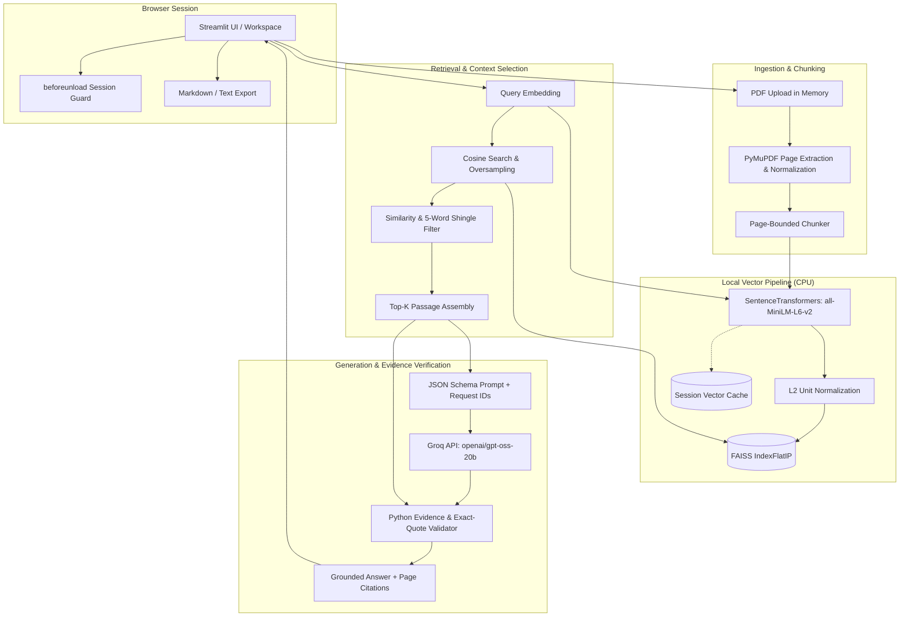

# Architecture

Folio is an in-memory, session-based Retrieval-Augmented Generation (RAG) application built with Python and Streamlit. It allows users to upload text-based PDFs, index them using local CPU-based embeddings, search passages with FAISS, and generate grounded answers through Groq with verifiable page-level citations.

---

## System Overview

---

## Component Responsibilities

| Component / Module | Responsibility |
| --- | --- |
| [`app.py`](../app.py) | Streamlit application layout, file upload handling, sidebar controls, chat history rendering, and session state orchestration. |
| [`src/config.py`](../src/config.py) | Server environment configuration, resource bounds, batch sizes, and similarity thresholds. |
| [`src/models.py`](../src/models.py) | Immutable and typed dataclasses: `Page`, `Chunk`, `Document`, `Hit`, `Support`, `Citation`, `Answer`, and `Turn`. |
| [`src/errors.py`](../src/errors.py) | Sanitized application errors that shield internal stack traces, API keys, and private cache paths from users. |
| [`src/ingestion/pdf_loader.py`](../src/ingestion/pdf_loader.py) | In-memory PDF validation (headers, limits, passwords), text extraction via PyMuPDF, NFKC normalization, and SHA-256 document hashing. |
| [`src/ingestion/chunker.py`](../src/ingestion/chunker.py) | Character-based, page-bounded chunking with sentence/paragraph boundary preference and context overlap. |
| [`src/retrieval/embeddings.py`](../src/retrieval/embeddings.py) | Process-wide cached SentenceTransformer loader (`@st.cache_resource`), batch encoding on CPU, L2 vector normalization, and session-level vector reuse. |
| [`src/retrieval/vector_store.py`](../src/retrieval/vector_store.py) | FAISS `IndexFlatIP` wrapper mapping index position `i` directly to `chunks[i]`. |
| [`src/retrieval/retriever.py`](../src/retrieval/retriever.py) | Candidate oversampling, cosine similarity filtering, 5-word shingle near-duplicate suppression, and character budget enforcement. |
| [`src/generation/groq_client.py`](../src/generation/groq_client.py) | Groq API client orchestration, JSON object mode formatting, and fail-closed evidence/quote validation. |
| [`src/generation/prompts.py`](../src/generation/prompts.py) | System prompt enforcing strict evidence boundaries, untrusted input isolation, and standardized fallback responses. |
| [`src/rag/pipeline.py`](../src/rag/pipeline.py) | Session-owned facade managing the active documents, FAISS index lifecycle, conversational history, and follow-up query rewriting. |
| [`src/export/chat_export.py`](../src/export/chat_export.py) | Markdown and plain-text export formatting; excludes internal IDs, vectors, and secrets. |
| [`src/ui/`](../src/ui/) | Custom CSS styling, brand header, citation/evidence accordions, and `beforeunload` browser unload protection. |

---

## Execution Flows

### 1. PDF Ingestion & Chunking
1. Uploaded files are received as raw bytes in memory. Folio never writes PDFs to disk or a database.
2. The file is validated: magic header (`%PDF-`), size cap (20 MB), page limit (500 pages), and password status.
3. PyMuPDF extracts text page by page with `sort=True` to preserve reading flow.
4. Text is normalized (NFKC, line un-wrapping, preserved paragraph breaks).
5. The chunker divides text within page boundaries (default 1,100 characters with 200 character overlap). Chunks never cross pages, ensuring strict provenance.
6. A document SHA-256 identity is computed from the original bytes. Duplicate files trigger no duplicate embeddings.

### 2. Local CPU Embeddings & FAISS Indexing
1. Text chunks are encoded into 384-dimensional dense vectors using `sentence-transformers/all-MiniLM-L6-v2`.
2. The model runs strictly on CPU (`EMBEDDING_DEVICE=cpu`) in batches of 32.
3. The underlying model is loaded once per process and shared across sessions via `@st.cache_resource`. Document vectors and chunk texts are stored strictly in session state.
4. Generated vectors are checked for finite values, non-zero norms, and normalized to unit L2 length.
5. Normalized vectors are loaded into a FAISS `IndexFlatIP`. Because vectors are L2-normalized, inner product equals cosine similarity.
6. The transactional document commit ensures that if embedding or indexing fails midway, previously indexed documents remain untouched.

### 3. Retrieval & Deduplication
1. The user's question (plus optional referential context for follow-ups like "explain that") is embedded via CPU.
2. FAISS performs an exact cosine similarity search over the session's chunks.
3. Candidate hits undergo multi-stage filtering:
   - **Threshold Cutoff**: Passages below `MIN_SIMILARITY` (default 0.25) are excluded.
   - **Shingle Deduplication**: Overlapping 5-word shingles filter out near-identical passages (>80% overlap) across documents or pages.
   - **Context Budget**: Top-K passages (default 5, configurable 3–8) are selected up to a maximum of 7,200 characters.

### 4. Generation & Evidence Validation
1. Selected passages are assigned request-local identifiers (`E1`, `E2`, …) to avoid leaking internal chunk IDs.
2. The prompt, question, style preference, and passages are sent to Groq (`openai/gpt-oss-20b`) in JSON object mode with temperature 0.
3. The model returns structured claims, each mapped to an evidence ID and an exact supporting quote.
4. Python executes fail-closed validation:
   - Verifies each evidence ID exists in the retrieved set.
   - Confirms the quote exists verbatim in the source passage (normalized whitespace).
   - Enforces a minimum quote length (12 characters or full passage).
   - Validates claim structure and bounds (1–8 claims, under 1,600 characters each).
5. If validation fails or context is insufficient, the system falls back safely to:
   > *"I couldn't find that information in the provided documents."*

### 5. Session State & Export Flow
1. All session state (`Pipeline`, documents, FAISS index, history) resides in `st.session_state`.
2. Document removal updates the FAISS index by rebuilding from retained session vectors without re-embedding.
3. Chat export generates Markdown (`.md`) or plain text (`.txt`) containing the export timestamp, document filenames, questions, answers, and numbered page citations.
4. A Streamlit custom component registers a browser `beforeunload` handler if unexported turns exist, warning users before closing the tab.

---

## Detailed References

- [RAG Pipeline Deep Dive](rag-pipeline.md)
- [Local Setup & Testing Guide](setup.md)
- [Deployment Guidelines](deployment.md)
- [System Limitations](limitations.md)
