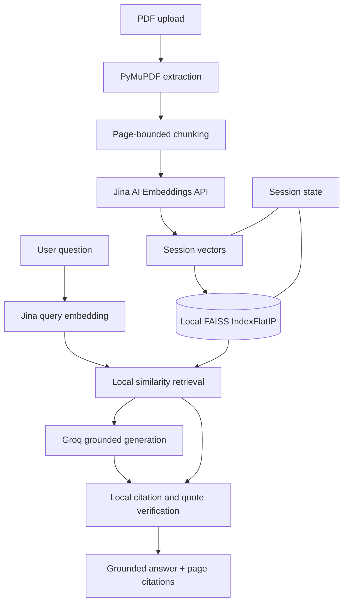

# Architecture

Folio is an in-memory Streamlit RAG application for text-based PDFs. PyMuPDF extracts and chunks documents locally; Jina AI creates embeddings remotely; FAISS performs local vector search; Groq generates answers remotely; Python verifies citations locally.

## System Overview

**Remote services:** Jina embeddings and Groq generation. **Local/server-side work:** PDF parsing, chunking, FAISS indexing and retrieval, citation verification, and ephemeral session state. No local embedding model is loaded or cached.

## Component Responsibilities

| Module | Responsibility |
| --- | --- |
| [`app.py`](../app.py) | Streamlit UI and session lifecycle. |
| [`src/config.py`](../src/config.py) | Environment configuration and resource limits. |
| [`src/ingestion/pdf_loader.py`](../src/ingestion/pdf_loader.py) | In-memory PDF validation, PyMuPDF extraction, normalization, and document hashing. |
| [`src/ingestion/chunker.py`](../src/ingestion/chunker.py) | Page-bounded chunking with overlap. |
| [`src/retrieval/embeddings.py`](../src/retrieval/embeddings.py) | Batched Jina API requests, vector validation, and per-session document-vector reuse. |
| [`src/retrieval/vector_store.py`](../src/retrieval/vector_store.py) | Local FAISS `IndexFlatIP`; index position maps to its source chunk. |
| [`src/retrieval/retriever.py`](../src/retrieval/retriever.py) | Similarity filtering, near-duplicate suppression, and context limits. |
| [`src/generation/groq_client.py`](../src/generation/groq_client.py) | Groq requests and fail-closed evidence/quote verification. |
| [`src/rag/pipeline.py`](../src/rag/pipeline.py) | Session-owned documents, index lifecycle, history, and retrieval orchestration. |

## Execution Flow

1. PyMuPDF extracts each PDF page in memory; blank pages retain their physical page numbers.
2. The chunker creates page-bounded passages with provenance and overlap.
3. Jina embeds passage batches when a document is indexed. Duplicate PDFs are rejected to avoid repeated indexing.
4. Normalized vectors are stored in a local FAISS index. Vectors can be reused during the session when documents are added or removed.
5. Each question is embedded through Jina, then FAISS returns similar passages subject to threshold, deduplication, and context limits.
6. Groq receives selected evidence and produces structured claims with quotes.
7. Python verifies evidence IDs and exact quote containment before showing the answer and page citations.

All document, vector, index, and conversation state is ephemeral and held by the Streamlit session/service process.

## References

- [RAG Pipeline](rag-pipeline.md)
- [Setup](setup.md)
- [Deployment](deployment.md)
- [Limitations](limitations.md)
